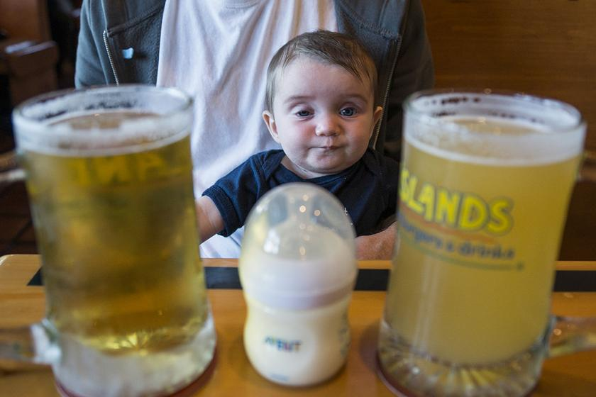

# Student Performance and Alcohol

An analysis of Student’s performance dataset from the UCI ML Repository - required as part of Udacity Data Scientist Nanodegree.

 
Image Source [Flickr](https://www.flickr.com/photos/evaxebra/13790965843)

## Table of Contents

1. [Libraries and Installation](#libraries-and-installation)
2. [Project Motivation](#project-motivation)
3. [Project Goals](#project-goals)
4. [File Descriptions](#file-descriptions)
5. [Results](#results)
6. [Licensing and Acknowledgements](#licensing-and-acknowledgements)

## Libraries and Installation
Most of the code in this project will run with Python version 3.*. 
The following libraries are used in the notebook: `numpy`, `pandas`, `matplotlib`, `sklearn`, and `seaborn`.
To install any library exectue 'pip install library_name' in terminal.

## Project Motivation
One of the reasons for my interest in this particular data set was the alcohol consumption attribute. This data set shows the workday and weekend alcohol consumption by students in a five-level marker- from 1 to 5. Alcoholism is a problem that many people have to fight against their whole life. The fact that secondary school students consume alcohol is a concern worth spending time over. Not only it damages their health at a young age, but it could also lead to addiction and subsequently hamper their chances of leading a happy and successful life.

## Project Goals
There are three questions that I am curious to know the answers of:
1. Of those who performed poorly, how many had high alcohol consumption?
2. Do students drink more, less, or the same on weekends as they do on workdays?
3. Does parents’ education affects student’s grades?

## File Descriptions
The files used in this project have been grouped as follows:
1. `students`: this directory contains the dataset downloaded from the UCI ML Repository.
2. `Student Performance and Alcohol.ipynb`: this file contains the code for analysis of the dataset.

## Results
The main findings from this project can be found at the post available [here.](https://abhyuday-singh.medium.com/students-performance-and-alcohol-faa797b8a551)

## Licensing and Acknowledgements
No licenses are required to use the code in this project, so feel free to use as required. I will also like to thank UDACITY for providing feedback. 
